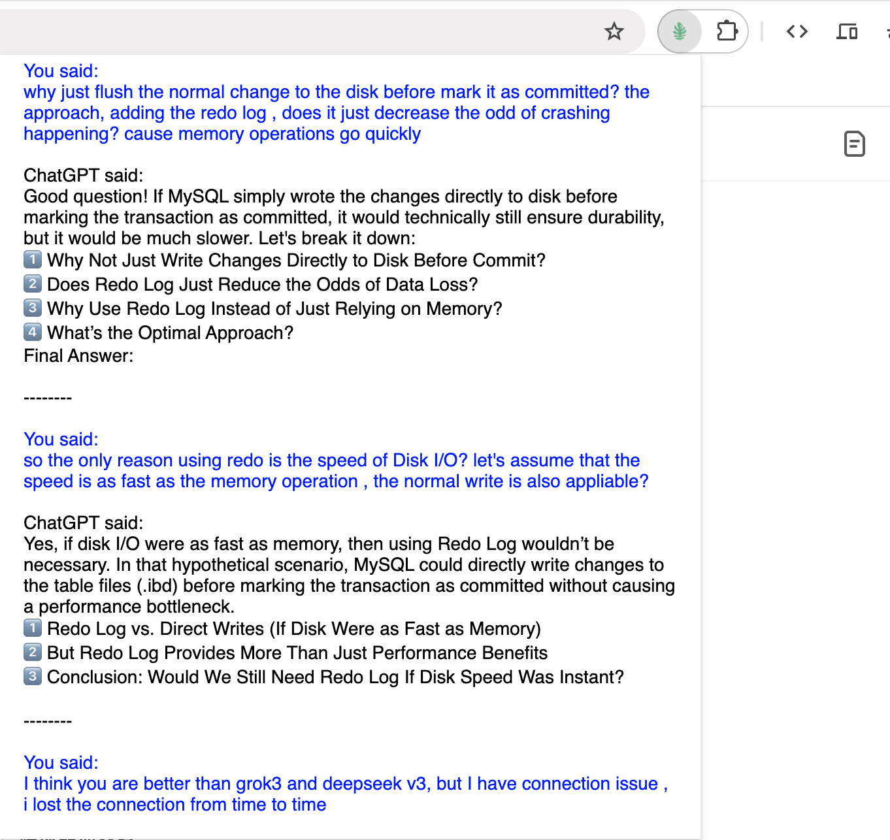

# ChatGPT Outliner

ChatGPT Outliner is a browser extension designed to extract Q&A content from ChatGPT pages and display it in a structured format.

## Features
- Automatically extracts Q&A content from ChatGPT pages.
- Highlights user and ChatGPT responses.
- Supports segmented content display.

## Screenshot

## Installation
1. Download or clone this project to your local machine.
2. Open your browser's extensions page (e.g., `chrome://extensions/` for Chrome).
3. Enable "Developer Mode."
4. Click "Load unpacked" and select the project folder.

## Usage
1. Open a ChatGPT page.
2. Click the ChatGPT Outliner icon in the browser toolbar.
3. View the extracted Q&A content.

## Development
Contributions and suggestions are welcome! Please submit a Pull Request or create an Issue.